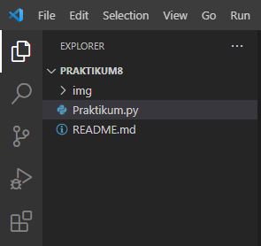

#   LATIHAN PRAKTIKUM 8 TENTANG OOP PADA PYTHON

#   ("Nama         :   Midun Hakiki")
#   ("NIM          :   312210583")
#   ("Kelas        :   TI.22.B1")
#   ("Mata Kuliah  :   Bahasa Pemrograman")

#   Langkah-langkah cara Menggunakan class dan menginstansiasi sebuah class lalu membuat program crud sederhana dengan class yaitu sebagai berikut :

1.) Pertama kita buat folder PRAKTIKUM8 dan didalam kita buat file bernama Praktikum.py

2.) Kita akan buat program crud sederhana dan berikut flowchart dan class diagram program yang akan dibuat.

flowchart :

class diagram :

3.) Lalu buka file Praktikum.py dan masukan codingan sebagai berikut, lalu run dengan mengetikan perintah berikut diterminal python Praktikum.py:

#   Berikut Hasilnya

-   Jika memilih opsi C = menambah data maka akan tampil sebagai berikut :

-   Jika memilih opsi R = Melihat semua data maka akan tampil sebagai berikut :

-   Jika memilih opsi U = mengupdate data maka akan tampil sebagai berikut :

-   Jika memilih opsi D = Menghapus data maka akan tampil sebagai berikut :

-   Jika memilih opsi Q = Keluar Program maka akan tampil sebagai berikut :

#   Kesimpulan 
#   Inilah Langkah-langkah Cara
         - Menggunakan class
         - menginstansiasi sebuah class
         - lalu membuat program crud sederhana dengan class

#   Sekian Dan Terimakasih...
